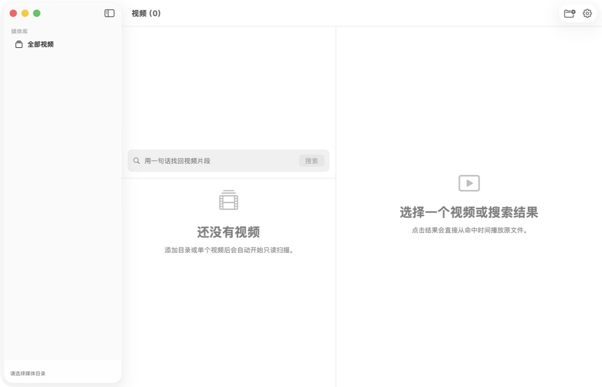
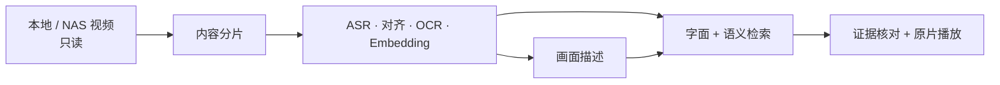
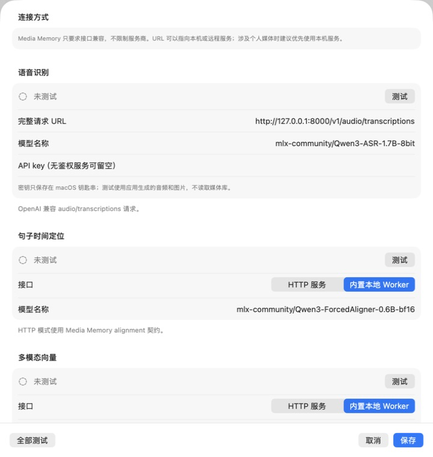

# Media Memory

一个本地优先的 macOS 个人影像搜索工具：把本地或 NAS 视频变成可核对、可搜索、可直接跳回原片的时间证据。



## 能做什么

- 只读扫描目录或单个视频，识别新增、移动、变化、缺失与暂时离线；
- 按画面变化与停顿生成内容片段，再提取 ASR、句子时间、OCR、代表帧与多模态向量；
- 字面结果立即返回，模型可用时异步合并语义召回；
- 每条结果展示命中的画面、语音或文字证据，并从源时间直接播放原文件；
- 建库、描述、扫描、搜索与浏览相互隔离，支持暂停、恢复、失败重试和异常退出恢复；
- 业务数据默认保存在本机，API key 只进入 macOS 钥匙串。



## 安装

要求 Apple silicon Mac、macOS 15 或更高版本。普通用户不需要安装 Xcode。

### DMG

从 [GitHub Releases](https://github.com/NimbuSHh/media-memory/releases) 下载 `Media-Memory-版本-arm64.dmg`，把 App 拖入 Applications。

这是没有 Apple 公证的个人开源应用。首次打开若被 macOS 拦截，请进入“系统设置 → 隐私与安全”，在 Media Memory 的安全提示下选择“仍要打开”。DMG 同时提供 SHA-256 校验文件。

### Homebrew

```bash
brew install --cask NimbuSHh/tap/media-memory
```

Homebrew 安装的也是同一份 GitHub Release DMG，首次打开可能仍需在“隐私与安全”中放行。

## 配置模型

Media Memory 不绑定模型供应商，也不要求服务一定在本机。每项能力分别配置请求 URL、模型名称和 API key；无鉴权服务可留空 key。

| 能力 | HTTP 接口 |
| --- | --- |
| 语音识别 | OpenAI 兼容 `audio/transcriptions` |
| 句子时间定位 | Media Memory alignment 契约，或内置本地 Worker |
| 多模态向量 | Media Memory multimodal embedding 契约，或内置本地 Worker |
| 画面描述 | OpenAI 兼容多模态 `chat/completions` |



配置页的每个模型都有“测试”按钮，会使用应用生成的测试音频/图片发送一次真实请求，不读取媒体库。四项测试成功后保存，再添加资源库即可使用。完整请求与响应格式见[模型服务接口](docs/model-service-api.md)。

为了避免个人音频、图片和文字证据经过网络，建议优先选择本机模型服务。若使用远程服务，请确认服务可信并使用 HTTPS；具体数据出口见[隐私与数据边界](docs/privacy.md)。

## 添加资源库

1. 点击“添加目录或视频”，选择本地/NAS 目录或视频文件；
2. 应用只读扫描并在后台完成分片、建库和描述；
3. 输入一句话搜索，点击结果即可从命中时间播放原片。

操作、错误恢复和删除方法见[使用指南](docs/user-guide.md)。

## 从源码构建

开发环境需要完整 Xcode 与 Swift 6.2：

```bash
./Scripts/build-app.sh
open ".build/Media Memory.app"
```

```bash
DEVELOPER_DIR=/Applications/Xcode.app/Contents/Developer xcrun swift test
```

真实模型和性能测试默认关闭，显式设置 `MEDIA_MEMORY_RUN_MODEL_TESTS=1` 或 `MEDIA_MEMORY_RUN_PERFORMANCE_TESTS=1` 后运行对应测试。发布流程见[发布说明](docs/releasing.md)。

## 发布边界

- DMG 使用临时签名，未加入 Apple Developer Program、未做 Developer ID 签名或 Apple 公证；
- 仓库和 DMG 不分发模型服务、Python/MLX 运行时或模型权重；
- 内置本地 Worker 是默认适配器，不是产品对 oMLX 的强制依赖；
- 不包含统计、遥测、崩溃上报、云端账号或自动更新。

## 许可证

[MIT License](LICENSE)。外部模型、运行时和服务分别适用其自身许可证。
