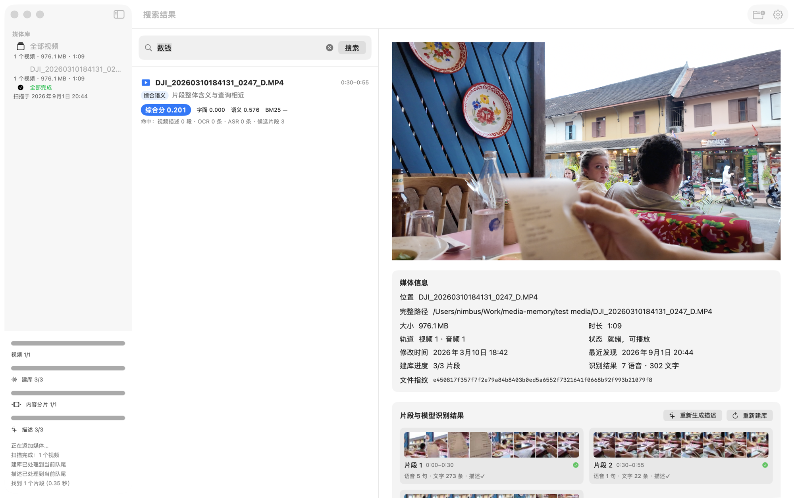
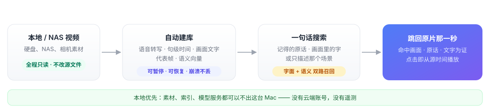
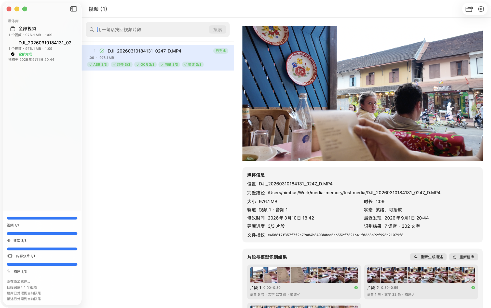

<div align="center">
  
  <h1>Media Memory</h1>
</div>

**把你的视频变成一句话就能找回的时间证据。**

硬盘和 NAS 里躺着几百个视频，你记得"拍过"，却永远找不到"在哪一段"。Media Memory 在本地把视频读完、听懂、建好索引：说出你记得的原话、画面里的字，或者只描述那个场景——它把那几秒找出来，附上证据，点击直接跳回原片播放。



> 本地优先的 macOS 原生应用 · Apple silicon · macOS 15+ · MIT

[安装](#安装) · [配置模型](#配置模型) · [使用指南](docs/user-guide.md)

---

## 它是怎么工作的



## 为什么不一样

### 每个结果都有证据，不是黑盒打分

搜索结果直接展示命中的**画面帧、口中原话、画面文字**——你能亲眼核对"它为什么命中"。点击结果，播放器从源时间轴的命中点开始播放原文件，不生成代理、不看低清预览。



### 字面与语义，两路都能查

- 记得原话？"六十万"、"欢迎光临"——语音转写按句子时间精确定位；
- 记得画面文字？菜单、路牌、字幕——OCR 全文可搜；
- 只记得场景？"在餐厅吃饭点啤酒"——语义向量按画面找回来。

三种线索一套搜索框，结果按视频聚合，长视频不会刷屏。

### 内容感知切片，不硬切

不按固定 20 秒切，而是跟随画面变化与自然停顿，切出 4–30 秒的内容片段——搜索命中落在完整的动作和句子上，而不是被拦腰截断的碎片。

### 原素材只读，删除可逆

扫描、识别、索引、播放全程不修改源文件。移除媒体库或单个视频只删除索引和派生数据，你的视频原封不动。打开应用只读取本地数据库，不会自动开始扫描或处理——扫描、建库、描述都等你显式启动（添加新媒体、右键"重新扫描"或面板上的 ▶）；添加媒体只扫描新增内容，不会触发全库逐文件重扫，文件消失可用右键"重新扫描"发现。

### 本地优先，数据不出机器

- 素材、索引、转写、描述全部保存在本机；
- API key 只进本机凭据文件 `model-credentials.json`（权限 0600，仅当前用户可读写），配置文件不含密钥；
- 没有云端账号、遥测、崩溃上报和自动更新；
- 模型服务可以全程运行在本机，个人素材不必经过任何网络。

### 模型供应商中立

不绑定任何供应商。四项能力（语音识别、句子时间定位、多模态向量、画面描述）分别配置请求地址、模型名称和鉴权方式，每项都有"测试"按钮用应用生成的样例验证连通。对齐和向量还可选用内置本地 Worker。


### 建库扛得住意外

处理一键暂停、恢复，失败可重试；异常退出后已完成结果保留、残留任务自动回队；NAS 断连时整体停车保护，不制造上百条失败记录，恢复连接后重扫即可续上。

## 30 秒上手

1. **装好应用** —— 从 [Releases](https://github.com/NimbuSHh/media-memory/releases) 下载 DMG 拖进 Applications；
2. **测通模型** —— 打开"模型设置"，四项测试通过后保存（默认配置指向本机服务）；
3. **添加目录，开始搜索** —— 选择本地/NAS 目录或单个视频，后台建库完成后输入一句话。

支持 `3gp` `avi` `m2ts` `m4v` `mkv` `mov` `mp4` `mts` `webm`（能否解码取决于系统 AVFoundation）。

## 浏览与筛选

媒体列表顶部有一排筛选：**类型**（视频/图片）、**进度**（处理中/待处理/有失败/已完成/未开始，与侧栏队列口径一致）、**时长**（四个区间，仅作用于视频）、**路径包含**（按相对路径匹配，大小写不敏感）。条件之间取交集，菜单里带各类数量；筛选生效时标题显示"结果/总数"。右侧菜单可按修改时间、大小、时长、入库时间排序。筛选与排序都是会话内的，重启后恢复默认视图。

## 安装

要求 **Apple silicon Mac、macOS 15 或更高版本**，无需 Xcode。

从 [GitHub Releases](https://github.com/NimbuSHh/media-memory/releases) 下载 `Media-Memory-版本-arm64.dmg`，把 App 拖入 Applications。Release 附带 SHA-256 校验文件。

这是未经 Apple 公证的个人开源应用，首次打开若被拦截：**系统设置 → 隐私与安全性 → 仍要打开**。从旧版本升级的签名与授权迁移说明见[使用指南](docs/user-guide.md#1-安装应用)。

## 配置模型

Media Memory 只认接口契约，不认品牌。每项能力独立配置，只有选择 Bearer 鉴权时才会读写该能力的 API key：

| 能力 | 接口 |
| --- | --- |
| 语音识别 | OpenAI 兼容 `audio/transcriptions` |
| 句子时间定位 | Media Memory alignment 契约，或内置本地 Worker |
| 多模态向量 | Media Memory multimodal embedding 契约，或内置本地 Worker |
| 画面描述 | OpenAI 兼容多模态 `chat/completions` |

"测试"按钮发送应用自生成的音频/图片样本，不读取媒体库。完整请求与响应格式见[模型服务接口](docs/model-service-api.md)。

> 建议优先使用本机模型服务。若使用远程服务请确认可信并启用 HTTPS，具体数据出口见[隐私与数据边界](docs/privacy.md)。

## 从源码构建

需要完整 Xcode 与 Swift 6.2：

```bash
./Scripts/build-app.sh
open ".build/Media Memory.app"
xcrun swift test
```

真实模型与性能测试默认关闭，开启方式与发布流程见[发布说明](docs/releasing.md)。

## 文档

- [使用指南](docs/user-guide.md) —— 安装、升级迁移、恢复操作
- [模型服务接口](docs/model-service-api.md) —— 四项能力的 HTTP 契约
- [隐私与数据边界](docs/privacy.md) —— 数据位置与网络出口
- [技术方案](docs/architecture.md) —— 产品与架构的单一方案来源

## 发布边界

- DMG 使用项目发布者的长期自签名身份，未加入 Apple Developer Program、未做 Developer ID 签名或公证；
- 仓库与 DMG 不分发模型服务、Python/MLX 运行时或模型权重；
- 不含统计、遥测、崩溃上报、云端账号或自动更新。

## 许可证

[MIT License](LICENSE)。外部模型、运行时和服务分别适用其自身许可证。
