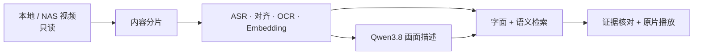

# Media Memory

一个本地优先的 macOS 个人影像搜索工具：把本地或 NAS 视频变成可核对、可搜索、可直接跳回原片的时间证据。


## 能做什么

- 只读扫描目录或单个视频，识别新增、移动、变化、缺失与暂时离线；
- 按画面变化与停顿生成可变长度内容片段，再提取 ASR、句子时间、OCR、代表帧与多模态向量；
- 字面结果立即返回，模型可用时异步合并语义召回；
- 每条结果展示命中的画面、语音或文字证据，并从源时间直接播放原文件；
- 建库、描述、扫描、搜索与浏览相互隔离，支持暂停、恢复、失败重试和异常退出恢复；
- 所有业务数据默认在本机持久化，API key 只进入 macOS 钥匙串。



## 环境要求

- Apple silicon Mac，macOS 15 或更高版本；
- 完整 Xcode，Swift 6.2；
- 本机 oMLX 与四个模型，默认配置见 [`default-models.json`](Sources/MediaMemoryCore/Resources/default-models.json)。

## 快速开始

```bash
./Scripts/build-app.sh
open ".build/Media Memory.app"
```

首次打开后：

1. 点击右上角“模型设置”，保存 Media Memory 专用的 oMLX 子 key；
2. 点击“添加目录或视频”，选择本地/NAS 目录或视频文件；
3. 扫描后自动分片、建库并生成描述；证据提交后即可搜索；
4. 输入一句话，点击结果从命中时间播放原片。

完整操作与恢复方法见[使用指南](docs/user-guide.md)。

## 隐私边界

默认 oMLX 地址为 `http://127.0.0.1:8000/v1`，源码不包含统计、遥测、崩溃上报或云端账号系统。源视频不被修改，也不会完整复制到应用目录。

设置页允许替换为其他 HTTP(S) 模型地址；此时片段音频、代表帧和文字证据会发送到该地址。非本机服务应使用 HTTPS，普通 HTTP 不提供传输加密。数据清单、持久化位置和删除语义见[隐私与数据边界](docs/privacy.md)。

## 开发与验证

当前默认测试：`82` 项执行，`79` 项通过，`3` 项按真实模型/性能开关正常跳过，`0` 项失败。

```bash
DEVELOPER_DIR=/Applications/Xcode.app/Contents/Developer xcrun swift build
DEVELOPER_DIR=/Applications/Xcode.app/Contents/Developer xcrun swift test
```

真实模型闭环默认跳过；它会读取被忽略的本地测试视频和 oMLX 中名为 `media-memory` 的子 key：

```bash
MEDIA_MEMORY_RUN_MODEL_TESTS=1 \
DEVELOPER_DIR=/Applications/Xcode.app/Contents/Developer \
xcrun swift test --filter ModelIntegrationTests
```

性能测试同样需要显式开启：

```bash
MEDIA_MEMORY_RUN_PERFORMANCE_TESTS=1 \
DEVELOPER_DIR=/Applications/Xcode.app/Contents/Developer \
xcrun swift test --filter SemanticVectorIndexTests/testTenThousandVectorHotRankingPerformance
```

## 当前发布边界

- `.app` 为本机临时签名构建，尚未做 Developer ID 签名、公证、DMG 或自动更新；
- 仓库不分发 oMLX、MLX/Python 运行时或模型权重；使用者需分别遵守上游许可证，模型 revision/SHA 尚未锁定；
- 真实模型/真实视频的多样本相关性、长时间运行、NAS 断连与磁盘/内存压力验收尚未完成；
- 持久代表帧还没有容量上限或自动淘汰策略；

更完整的实现、决策与验收边界见[架构文档](docs/architecture.md)。

## 许可证

[MIT License](LICENSE)。仓库不包含 oMLX、MLX/Python 运行时或模型权重；这些外部组件分别适用其上游许可证。
