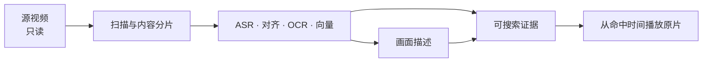

# Media Memory 使用指南

Media Memory 把本地视频整理成可核对的搜索证据，并从命中时间直接播放原片。源视频始终只读。


## 1. 准备模型

先启动 oMLX，并准备以下模型：

- `mlx-community/Qwen3-ASR-1.7B-8bit`：由 oMLX 加载；
- `mlx-community/Qwen3-ForcedAligner-0.6B-bf16`：保留在模型目录，不在 oMLX 重复加载；
- `mlx-community/Qwen3-VL-Embedding-2B-bf16`：保留在模型目录，不在 oMLX 重复加载；
- `mlx-community/Qwen3.8-27B-4bit`：由 oMLX 加载。

先从 [oMLX 官方 Releases](https://github.com/jundot/omlx/releases) 安装 macOS 应用；官方安装与服务说明见 [oMLX README](https://github.com/jundot/omlx#install)。首次启动会引导选择模型目录、启动服务和下载模型，也可在 `http://127.0.0.1:8000/admin` 的模型管理页完成下载与加载。

参考环境使用 oMLX `0.6.2`；四组静态权重合计约 24.1 GB，实际还需要运行时、缓存和代表帧空间，最低内存尚未完成验证。让 ASR 与 Qwen3.8 保持加载，为 Media Memory 创建一个独立 API key（或子 key），然后运行 `omlx start`。若管理页能看到四个模型且服务状态正常，即可继续。

构建并打开应用：

```bash
./Scripts/build-app.sh
open ".build/Media Memory.app"
```

> 当前是本机自用构建：使用临时签名，尚未做 Developer ID 签名、公证和自动更新。

## 2. 配置一次

点击右上角齿轮：

1. 保持默认的本机服务地址与模型 ID；
2. 填入 Media Memory 专用的 oMLX 子 key；
3. 保存。


API key 只写入 macOS 钥匙串。默认服务地址为 `127.0.0.1`；若改为其他 HTTP(S) 地址，片段音频、代表帧和文字证据会发送到该地址，详见[隐私与数据边界](privacy.md)。

## 3. 添加视频

点击“添加目录或视频”，可以选择：

- 一个或多个本地/NAS 目录；
- 多个视频文件；
- 单个视频文件。

应用会持久化只读授权，识别新增、移动、变化、缺失和暂时离线的视频。扫描不复制或改写源文件。

支持 `3gp`、`avi`、`m2ts`、`m4v`、`mkv`、`mov`、`mp4`、`mts`、`webm`；最终能否解码取决于当前 macOS 的 AVFoundation。



## 4. 等待建库

左下角显示建库与描述进度：

- 建库先分析画面变化与停顿，再完成 ASR、句子时间定位、OCR 和向量；新一代内容片段全部完成后才整体切换，避免搜索混用新旧证据；
- 描述在后台逐段生成并缓存，失败或尚未完成不会影响已有字面/向量结果；
- 界面的“建库”控制组同时管理内容分片与证据建库；“描述”车道可单独暂停、继续和重试。扫描、搜索与视频浏览不受影响；
- 异常退出后重新打开，已完成结果保留，残留任务回到队列。

## 5. 搜索与核对

在中间栏输入一句话并回车：

1. ASR、OCR 和已缓存画面描述的字面结果先返回；
2. 模型可用时，语义结果随后合并；
3. 每个视频只显示一次，并展示真正命中的画面、语音或文字证据；
4. 点击结果，从命中片段的源时间播放原文件。

语义分支失败不会清空字面结果。后台新完成的片段会在下一次查询中加入，不会污染本次一致性快照。

## 6. 常用恢复操作

| 情况 | 操作 | 影响范围 |
| --- | --- | --- |
| 单个片段识别异常 | “重新处理该片段” | 该片段的 ASR/对齐/OCR/向量 |
| 整个视频需要重做 | “重新建库” | 该视频全部片段，描述随后更新 |
| 只想刷新画面描述 | “重新生成描述” | 片段、视频或全库旧版描述 |
| 某条车道失败 | 左下角失败列表中重试 | 只重试对应车道 |
| NAS 暂时离线 | 恢复连接后重新扫描 | 稳定指纹相同则复用既有索引 |

“从媒体库移除”会先停下扫描与后台写入，再清理证据和不再引用的代表帧；源视频不会被删除。移除单个视频会保留一条路径/指纹排除记录，防止后续扫描重新纳入；若需要彻底清除数据库痕迹，请按[隐私与数据边界](privacy.md)中的“删除与退出”操作。

## 数据位置

```text
~/Library/Application Support/MediaMemory/
```

这里包含数据库、无密钥模型配置、临时工作目录和持久代表帧；API key 位于 macOS 钥匙串。完整清单、网络出口和删除方式见[隐私与数据边界](privacy.md)。
