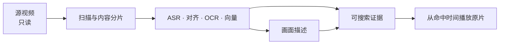

# Media Memory 使用指南

Media Memory 把本地视频整理成可核对的搜索证据，并从命中时间直接播放原片。源视频始终只读。


## 1. 安装应用

从 [GitHub Releases](https://github.com/NimbuSHh/media-memory/releases) 下载 arm64 DMG，打开后把 `Media Memory.app` 拖到 Applications。应用支持 Apple silicon 与 macOS 15 及更高版本，普通用户不需要 Xcode。

本项目没有购买 Apple Developer Program，DMG 未经 Apple 公证。首次打开若被系统拦截：

1. 打开“系统设置”；
2. 进入“隐私与安全”；
3. 在 Media Memory 的安全提示下点击“仍要打开”；
4. 再次确认打开。

也可以通过项目自己的 Homebrew Tap 安装：

```bash
brew install --cask NimbuSHh/tap/media-memory
```

Homebrew 使用同一份 DMG，因此首次启动仍可能需要上述放行操作。

## 2. 准备模型服务

Media Memory 不识别或限制服务商，只验证接口能力。服务既可以运行在 `127.0.0.1`，也可以是受信任的远程 HTTPS 地址。

| 能力 | 支持方式 |
| --- | --- |
| 语音识别 | OpenAI 兼容 `audio/transcriptions` |
| 句子时间定位 | Media Memory alignment HTTP 契约；或内置本地 Worker |
| 多模态向量 | Media Memory multimodal embedding HTTP 契约；或内置本地 Worker |
| 画面描述 | OpenAI 兼容多模态 `chat/completions` |

完整 HTTP 请求与响应格式见[模型服务接口](model-service-api.md)。

仓库内的默认配置是一个已经验证过的本机示例：ASR 与描述使用 `127.0.0.1:8000` 的 OpenAI 兼容接口，对齐与向量使用本地 Worker。oMLX 可以提供这套参考环境，但不是产品强制依赖；也可以把任意一项换成其他兼容服务。

如果服务在远程，片段音频、图片或文字证据会根据能力发送给它。个人媒体建议优先使用本机服务；远程地址应使用 HTTPS。

## 3. 配置并测试

打开右上角“模型设置”。每个模型分别填写：

- 完整请求 URL；
- 模型名称；
- API key，无鉴权服务可留空；
- 对齐和多模态向量还可以选择“内置本地 Worker”。


每个模型右侧都有“测试”，底部还有“全部测试”。测试会使用应用即时生成的短音频和测试图片发送真实推理请求，不读取资源库内容。

测试结果会区分连接失败、超时、鉴权失败、模型不存在、接口不兼容和返回结构错误。修改该模型的 URL、模型名、key 或 Worker 路径后，原测试结果自动失效，需要重新测试。

API key 分能力存入 macOS 钥匙串，不写入 `models.json`、日志、项目目录或 DMG。四项可用后点击“保存”。测试不是保存的强制门槛，但建议首次使用前全部通过。

## 4. 添加视频

点击“添加目录或视频”，可以选择：

- 一个或多个本地/NAS 目录；
- 多个视频文件；
- 单个视频文件。

应用会持久化只读授权，识别新增、移动、变化、缺失和暂时离线的视频。扫描不修改源文件。

支持 `3gp`、`avi`、`m2ts`、`m4v`、`mkv`、`mov`、`mp4`、`mts`、`webm`；最终能否解码取决于当前 macOS 的 AVFoundation。



## 5. 等待建库

左下角显示建库与描述进度：

- 建库先分析画面变化与停顿，再完成 ASR、句子时间定位、OCR 和向量；新一代内容片段全部完成后才整体切换；
- 描述在后台逐段生成并缓存，失败或尚未完成不会清空已有字面/向量结果；
- “建库”和“描述”可以分别暂停、继续和重试，扫描、搜索与视频浏览不受影响；
- 异常退出后重新打开，已完成结果保留，残留任务回到队列。

## 6. 搜索与核对

在中间栏输入一句话并回车：

1. ASR、OCR 和已缓存画面描述的字面结果先返回；
2. 向量服务可用时，语义结果随后合并；
3. 每个视频只显示一次，并展示真正命中的画面、语音或文字证据；
4. 点击结果，从命中片段的源时间播放原文件。

语义分支失败不会清空字面结果。后台新完成的片段会在下一次查询中加入，不会污染本次一致性快照。

## 7. 常用恢复操作

| 情况 | 操作 | 影响范围 |
| --- | --- | --- |
| 模型测试失败 | 展开失败信息并修正 URL、模型名、key 或接口 | 只影响正在测试的模型 |
| 单个片段识别异常 | “重新处理该片段” | 该片段的 ASR/对齐/OCR/向量 |
| 整个视频需要重做 | “重新建库” | 该视频全部片段，描述随后更新 |
| 只想刷新画面描述 | “重新生成描述” | 片段、视频或全库旧版描述 |
| 某条车道失败 | 左下角失败列表中重试 | 只重试对应车道 |
| NAS 暂时离线 | 恢复连接后重新扫描 | 稳定指纹相同则复用既有索引 |

“从媒体库移除”会先停下扫描与后台写入，再清理证据和不再引用的代表帧；源视频不会被删除。移除单个视频会保留一条路径/指纹排除记录，防止后续扫描重新纳入。彻底删除方法见[隐私与数据边界](privacy.md)。

## 数据位置

```text
~/Library/Application Support/MediaMemory/
```

这里包含数据库、无密钥模型配置、临时工作目录和持久代表帧；API key 位于 macOS 钥匙串。完整清单、网络出口和删除方式见[隐私与数据边界](privacy.md)。
